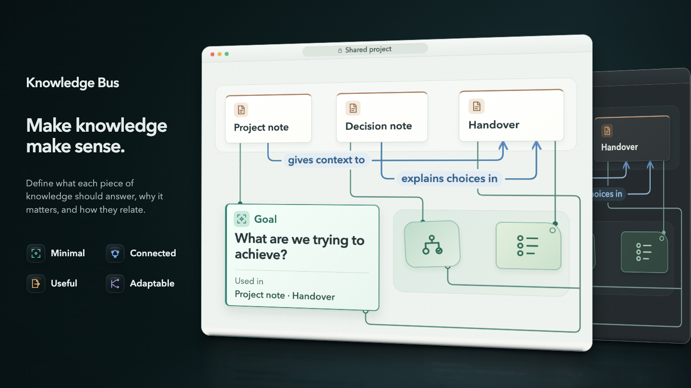

<!-- markdownlint-disable MD033 MD041 -->
<div align="center">



# Knowledge Bus

A protocol for structuring knowledge so humans and AI agents can work from the same understanding.

[](https://github.com/SterlingJF/knowledge-bus/releases/latest)
[](https://github.com/SterlingJF/knowledge-bus/actions/workflows/ci.yml)
[](LICENSE)

[What is Knowledge Bus?](#what-is-knowledge-bus) • [Where It Helps](#where-it-helps) • [Features](#features) • [Installation](#installation) • [Quick Start](#quick-start) • [How It Works](#how-it-works) • [Limits](#limits) • [Docs](#docs)

</div>
<!-- markdownlint-enable MD033 MD041 -->

---

Define the questions your notes and documents need to answer, how their contents connect, and the decisions and actions they should support. Use those expectations to guide new work, review contributions, and exchange knowledge.

## What is Knowledge Bus?

Knowledge Bus is a protocol for describing what knowledge means and how it fits together. It gives people and AI agents a common reference for writing, reading, and using notes and documents.

For a project, subject, or area of responsibility, you can define:

- **Questions** — the questions the content needs to answer;
- **Outcomes** — the decisions or actions each document supports;
- **Requirements** — the information required for that purpose;
- **Relationships** — how information connects across documents;
- **Conditions** — which requirements change with the audience or situation;
- **Quality** — guidance for answering well;
- **Provenance** — who is expected to provide an answer and how to know if the answer is premature or stale.

### "So it's a knowledge template?"

A template gives a document its sections. Knowledge Bus also defines what those sections mean, why they belong, and how their contents relate to other documents. Different documents can refer to the same knowledge, reducing the need to repeat the thinking or maintain separate copies.

### "How is it any different from a knowledge map?"

Tools such as [Understand Anything](https://github.com/Egonex-AI/Understand-Anything) analyze *existing* material to explain its contents and connections. Knowledge Bus lets people and agents agree on the questions the content needs to answer, what belongs in each document, and how the pieces relate—even before the first document is written. Those same definitions can then guide new contributions and help interpret existing material.

## Where It Helps

Knowledge Bus can guide a personal notebook, a shared project folder, or documentation across teams. Its definitions give contributors clear expectations and help later readers understand the thinking behind the content.

- **Personal notes:** decide what you want to capture and keep enough context to understand it later.
- **Everyday projects:** record decisions, unanswered questions, and the information someone needs to take over.
- **Team documentation:** give contributors shared expectations across briefs, plans, decisions, and handovers.
- **AI collaboration:** give agents explicit definitions and guidance to follow when asking questions, drafting, or reviewing.
- **Knowledge exchange:** describe how information can move between people and tools while retaining its meaning and context.

You can adopt an existing set of definitions or develop one for your own work. The included product-development example provides a starting point; the protocol supports other subjects and uses.

## Features

- **Knowledge definitions** — identify each piece of knowledge by the question it answers, so different headings and filenames do not give it different meanings.
- **Document composition rules** — define the decision or action a document supports, then specify the information someone needs to make that decision or take that action.
- **Authoring guidance** — attach advice and its sources to relevant definitions, keeping recommendations separate from requirements.
- **Attribution and history** — record who stated something, who is bound by it, its status, and when it was established. Preserve earlier versions when new assertions replace them.
- **Knowledge exchange rules** — define how to share knowledge between different structures while preserving its meaning, source, and status. Keep disagreements visible for the receiver to resolve.
- **Product-development starter** — adopt or adapt reference definitions for product development, including briefs, plans, and decision records.
- **Agent skills** — clarify questions and check for overlap, recover a decision's reasoning and the conditions for reconsidering it, and add or re-examine document types.
- **Folder ingestion** — map existing notes to sourced answers, surface conflicts for your review, and report gaps without changing the originals.
- **Conformance checker** — check definition and guidance files for missing declarations, unresolved references, and other structural errors.
- **Evals** — rules for definition wording and agent behaviour, each with passing and failing examples, graded in code first and by models where code cannot settle a case.
- **Explorer** — open your definitions as an interactive map that works offline, and export it as SVG.

## Gallery

Use the reference material as a starting point for your own work. You can adopt it, trim it, extend it, or develop a different set of definitions.

See [Adapting the Example](docs/adapting-the-example.md).

Definitions live in `.knowledge-bus/` inside the folder they describe. Checking from a nested directory uses the nearest `.knowledge-bus/` directory. See [Knowledge Bus Directory](docs/knowledge-bus-directory.md) for discovery and write rules.

### Product Development

The included product-development definitions cover the reasoning around deliberate work: what makes it worth doing, what it should be, and whether it held up. Their document types include strategy canvases, lean canvases, decision records, design documents, and experiment plans, with declared relationships between those types and their contents.

The companion guidance attaches advice to those definitions and cites registered sources, including Pichler, Moore, Porter, Osterwalder, and Maurya. For current counts, run `uv run kbp` in a clone or open the Explorer, which shows them beside the universe name.

<!-- markdownlint-disable-next-line MD033 -->
<a href="docs/assets/product-development-map.svg"></a>

The image shows part of the map; select it to open the full map.

## Installation

Requires your agent's CLI and Node.js/npm. Checker-backed skills also require [uv](https://docs.astral.sh/uv/getting-started/installation/) and Python compatible with the [checker package requirement](checker/pyproject.toml).

### Claude Code

In Claude Code chat:

```text
/plugin marketplace add SterlingJF/knowledge-bus
/plugin install knowledge-bus@knowledge-bus
```

Or in your terminal:

```sh
claude plugin marketplace add SterlingJF/knowledge-bus
claude plugin install knowledge-bus@knowledge-bus
```

### Codex

In your terminal:

```sh
codex plugin marketplace add SterlingJF/knowledge-bus
codex plugin add knowledge-bus@knowledge-bus
```

Start a new session after installation.

### Pi

In your terminal:

```sh
pi install npm:@knowledge-bus/pi@latest
```

Run `/reload` in an existing Pi chat to load the skills.

### OpenCode

In your terminal:

```sh
opencode plugin @knowledge-bus/opencode@latest
```

Start a new session after installation. Add `--global` to use it across projects.

### Other Agents or Individual Skills

Choose your agent and skills:

```sh
npx skills add SterlingJF/knowledge-bus
```

Or select a specific skill:

```sh
npx skills add SterlingJF/knowledge-bus --skill kb-check
```

These commands use the default branch, not the latest release. Add `--global` to use the skills across projects. Choose either the plugin or individual skills for each agent to avoid duplicate entries.

[Updates and troubleshooting](docs/agent-plugins.md)

### Standalone Checker

The checker also works without an agent:

```sh
git clone https://github.com/SterlingJF/knowledge-bus.git
cd knowledge-bus
uv run kbp
```

The checkout can inspect a universe without writing or generate an offline Explorer at an explicit destination:

```sh
uv run kbp --inspect path/to/.knowledge-bus/
uv run kbp --explore --output path/to/.knowledge-bus/explorer/<universe-id> path/to/.knowledge-bus/
```

## Quick Start

### Start With Expectations

> What does the knowledge need to answer, and what should it enable?

You can adapt a reference, describe the area of knowledge, or link to your existing documents. Ask your agent to use `kb-uncover-question` to sharpen a question, or `kb-evolve` to add or re-examine a document type. See [Adapting the Example](docs/adapting-the-example.md).

### Working With Existing Notes

Knowledge Bus can also help recover structure from existing files. The ingestion skill reads a folder, maps its contents to the questions they answer, and flags disagreements and missing information. It asks you to resolve uncertainty and writes its outputs in `.knowledge-bus/` inside that folder.

1. Ask your agent to use `kb-ingest` with the path to a folder of notes or documents.
2. Review its initial findings and proposed definitions. Answer any questions about conflicts or uncertain information.
3. Review the outputs in `<folder>/.knowledge-bus/`: definitions, guidance, sourced answers, and a record of decisions made during ingestion.
4. Review unresolved conflicts, potentially outdated content, material that did not fit, and unanswered questions.
5. Use `kb-check` after editing definition or guidance files.

Your existing source files remain unchanged.

See the [Walkthrough](docs/walkthrough.md) for a complete example.

### Keep It Current

Open the definitions as a map with `kb-explore`. When a question or document type stops fitting, revise it with `kb-uncover-question` or `kb-evolve`, then run `kb-check`.

## Commands

| Command                | What it does                                                                                                                       |
| ---------------------- | ---------------------------------------------------------------------------------------------------------------------------------- |
| `/kb-uncover-question` | Clarifies a question and checks that it does not duplicate an existing one.                                                        |
| `/kb-uncover-decision` | Recovers a decision's alternatives, constraints, authority, and conditions for reconsidering it.                                   |
| `/kb-evolve`           | Adds or re-examines a document type or the definitions around it, including purpose, contents, relationships, guidance, and terms. |
| `/kb-explore`          | Explains your definitions and opens them as an offline map with SVG export.                                                        |
| `/kb-ingest`           | Maps existing notes to sourced answers and reports conflicts, outdated information, and gaps.                                      |
| `/kb-check`            | Checks definition and guidance files and explains any conformance failures.                                                        |

## How It Works

### 1. Questions Identify Knowledge

A knowledge element is defined by the question its content answers. Two sections answering the same question refer to the same element, even if their headings differ.

The protocol calls a declared set of knowledge elements, document types, and their relationships a **universe**.

A universe can also declare its own terms, each with one fixed meaning. Knowledge still matches across universes by question, not by term.

### 2. Purpose Determines Document Contents

A document type is called an **artifact** in the protocol. It is defined by the decision or action it enables and the person who needs to take it.

Its core contents are the information that person needs to make the decision or take the action. Other contents depend on the situation.

### 3. Context Changes What Is Needed

Context rules can change which information is included or required, or disable a document type. Every universe must also say when no document is needed.

Relationships declare dependencies, distinctions, and other connections between knowledge elements and document types.

### 4. Guidance Stays Separate From Requirements

The universe file holds the definitions and structural rules. A companion guidance file explains how to answer well and identifies the sources or assertions behind that advice.

Guidance is advisory. You can depart from the advice and still follow the protocol's requirements.

### 5. Assertions Retain Their Context

An **instance** records an asserted answer and who stated it. Its status indicates how the assertion should be treated; its timestamp records when the value was established, not when it expires. The protocol separately records who is bound by the assertion. For example, one person may state a requirement that another person must follow.

Multiple assertions can coexist. A new assertion can replace an earlier one, while the earlier version remains available for reference.

### 6. Exchange Preserves Differences

The protocol defines four steps: compose, transmit, decode, and reconcile.

A sender composes knowledge for a purpose, using the definitions' selection frames where there are any. The receiver interprets it within their own definitions and context. The receiver matches information by the question it answers and records disagreements rather than silently overwriting them.

### 7. The Checker Verifies Structure

The checker validates the protocol against itself, then checks definition and guidance files against supported conformance rules. It reports failures such as missing declarations, unresolved references, and invalid structural relationships.

People still need to review the meaning: a definition can pass the checks and still ask the wrong question.

### 8. Evals Grade What Structure Cannot Show

Evals grade definition wording against written rules: each question asks one thing, no two questions ask for the same knowledge, each passage is filed under the question it answers, and real cases land on the right value of each dimension, such as audience. Code settles what it can. A fast classifier answers one literal question, and two Claude models judge the rest by default; a verdict stands only when both agree. A case no tier settles goes to you.

See [Evals](evals/README.md).

## Limits

- Agent output still requires review.
- The checker validates definition and guidance files. It does not yet validate the `answers.yaml` and `ingest-log.md` files that ingestion writes.
- Structural checking and Explorer rendering do not establish that an answer is true or that a definition captures the right question.
- Evals grade definition wording against the project's written rules. The model tiers call paid models and can disagree; a case no tier settles goes to you. A pass does not show that a definition fits your work.
- `just evals-play` plays agent-behaviour scenarios with a scripted owner, one run each by default.
- The protocol defines composition and exchange rules. Knowledge Bus does not include tools that compose documents or interpret incoming knowledge.

## Roadmap

### Milestones

- [x] An offline, dependency-free map for exploring definitions ([Knowledge Bus Explorer](docs/knowledge-bus-explorer.md))
- [x] Skills for each step today: ingest a knowledge base, uncover questions and decisions, evolve definitions, and check and explore them
- [ ] A model-agnostic guided workflow: one coordinating agent with bounded helper agents, using whatever models and decision models are available, works with one person or a team of domain experts through before-and-after proposals to create or extract a universe, align an existing personal, team, or enterprise knowledge base to it, and evolve it when something triggers a change
- [x] Composition rules: what a document holds, given its purpose and audience
- [ ] Tools that compose documents and interpret incoming knowledge
- [ ] Markdown interchange format
- [x] A standard `.knowledge-bus/` directory so tools can discover shared definitions
- [x] Evals for definition wording ([Evals](evals/README.md))
- [x] Evals for agent behaviour ([Evaluation Report](evals/report.md))
- [ ] Validation of the `answers.yaml` and `ingest-log.md` files that ingestion writes

### Further Exploration

- Knowledge exchange between different sets of definitions
- Forms and surveys designed around the decisions their answers support
- A second reference universe, such as scientific research

### Open Questions

The [evals](evals/README.md) grade definition wording. These questions remain open:

- How much reasoning is preserved when knowledge is extracted and turned back into a document?
- How reliably do agents follow the definitions and guidance?
- Do agents leave questions unanswered when they lack supporting information?

## Project Map

```text
knowledge-bus/
├── protocol/                       authored conformance contract
│   ├── knowledge-bus-protocol.yaml
│   ├── CHANGELOG.md                 protocol history
│   └── conformance/                 shared valid and invalid examples
├── checker/                        installable Python package: knowledge-bus
│   ├── pyproject.toml               package metadata and release version
│   ├── hatch_build.py               includes the protocol in distributions
│   ├── src/kbp_conform/             validation library and kbp command
│   └── tests/                       conformance and discovery tests
├── universes/                      maintained reference definitions
│   └── product-development/
├── explorer/                       @knowledge-bus/explorer: universe viewer and SVG export
│   ├── src/                         CE Pattern layers: elements, patterns, lib
│   ├── prebuilt/                    installed Explorer viewer
│   ├── styles/                      visual token authority and generated CSS
│   └── test/                        unit, adapter, fixture, and browser tests
├── skills/                         authored workflows and generated portable resources
├── plugins/                        agent adapters and shared runtime
├── evals/                          eval rules, agent behaviours, examples, fixtures, situations, and results
├── tools/
│   ├── explorer/                   model adapter, build, render, and explorer checks
│   ├── ce-pattern/                 vendored CE Pattern tooling and project config
│   ├── evals/                      eval reader, tier engine, grader, scenario player, report builder, and runner generators
│   ├── plugin/                     package assembly, inspection, and tests
│   ├── quality/                    check runner and git-hook snapshots
│   └── release/                    release commands and their tests
├── docs/                           usage guides and explanations
├── CONTRIBUTING.md                 development setup and checks
├── .github/workflows/
├── package.json                    pnpm orchestration only
├── pnpm-workspace.yaml             agent package workspace
├── pnpm-lock.yaml                  shared JS dependency lock
├── pyproject.toml                  uv orchestration only
├── uv.lock                         shared Python dependency lock
├── justfile                        development commands
└── CHANGELOG.md                    product release history
```

The protocol defines conformance; the checker implements it. Universes provide reference definitions, and skills guide agents in working with them.

The checker distribution includes the protocol. Agent packages include their skills and runtime; individually installed skills carry their own required resources.

See [Contributing](CONTRIBUTING.md) for development setup, source layout, and checks.

## Docs

- [Walkthrough](docs/walkthrough.md) — one folder through ingestion, start to finish.
- [How Ingest Works](docs/how-ingest-works.md) — the steps, decisions, and coverage report.
- [Adapting the Example](docs/adapting-the-example.md) — adopt, trim, or extend the included definitions.
- [Knowledge Bus Explorer](docs/knowledge-bus-explorer.md) — explore a universe as a map and export it.
- [Knowledge Bus Directory](docs/knowledge-bus-directory.md) — where definitions live and how tools find them.
- [Spec Anatomy](docs/spec-anatomy.md) — the structure of a definition file.
- [Validation](docs/validation.md) — what the checker verifies and rejects.
- [Evals](evals/README.md) — the rules and behaviours that define good definitions and agent work, and how they are graded.
- [Evaluation Report](evals/report.md) — figures from recorded runs.
- [Versioning](docs/versioning.md) — version meanings, compatibility, and installation versions.
- [Agent Packages and Skills](docs/agent-plugins.md) — updates, requirements, and troubleshooting.
- [Design Notes](docs/design-notes.md) — the reasoning behind question identity, separate guidance, and stable codes.

## License

MIT. Issues welcome; PRs by discussion first.
